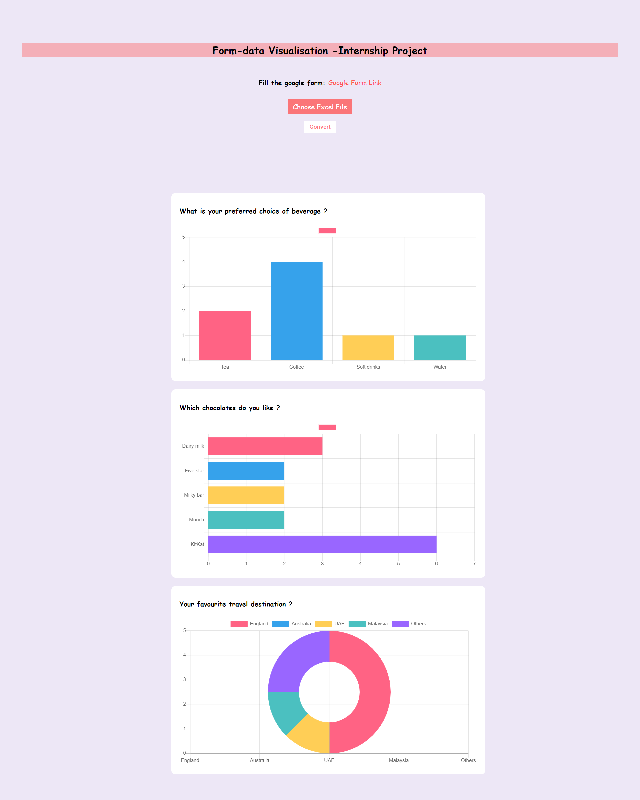

# Form-Data Visualisation Internship Project

Project to read the data from a google form. This module renders data from the CSV/ xls/ xlsx file generated by the 
google form and visualizes the output in a beautiful chart format.

<a href="https://priyalweb.github.io/Form-Data-Visualisation/">Website URL</a>

# Tech-stacks

JavaScript, chartJS lib, Ajax, HTML, CSS.

# Quick Start

Fill the google-form survey provided, download the responses of the excel file in csv or xlsx format. 
Upload the file, and convert in to render the output graphs. 

